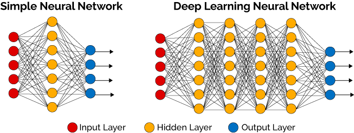

# aim2 workshop - From models to complete solutions using OpenVINO

### Luca Ruzzola, Machine Learning Engineer @ aim2.io

### What is computer vision
*"**Computer vision** is concerned with the automatic extraction, analysis and understanding of useful information from a single image or a sequence of images. It involves the development of a theoretical and algorithmic basis to achieve automatic visual understanding."*

### What is deep learning
*"**Deep Learning** is a class of machine learning algorithms that use a cascade of multiple layers of nonlinear processing units for feature extraction and transformation to learn multiple levels of representations that correspond to different levels of abstraction; the levels form a hierarchy of concepts."*

*"**Machine Learning** is the discipline that provides systems the ability to automatically learn and improve from experience without being explicitly programmed."*

*"**AI** is the discipline dealing with the designing and building of intelligent agents that receive percepts from the environment and take actions that affect that environment."*

### What is a CNN
A **CNN** is a neural network that uses kernel convolution instead of matrix multiplication in one or more of its layers.

## Let's get our hands dirty!

# Environment setup
Please clone this repository

*git clone https://github.com/lucaruzzola/aaeon_workshop*

If you don't have git installed you can install it executing this command in a terminal: *sudo apt-get install git*

Create the Anaconda environment as such: *conda env create -f workshopenv.yml*

If you don't have Anaconda installed alredy you can download it from: *https://repo.anaconda.com/archive/Anaconda3-2018.12-Linux-x86_64.sh*

To test that everything is working please type in a terminal:

*source activate workshop*

*source /opt/intel/computer_vision_sdk/bin/setupvars.sh*

*python blur.py*

If everything is working as expected you should see the live video from your camera with blurred faces.

You can then quit the demo by pressing "q" and start the notebook for this session typing in the same terminal:

*python -m jupyter notebook*
